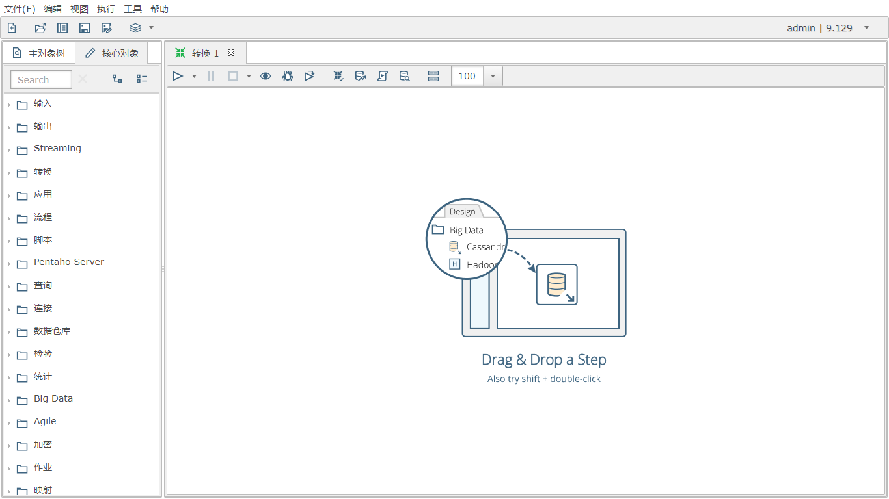
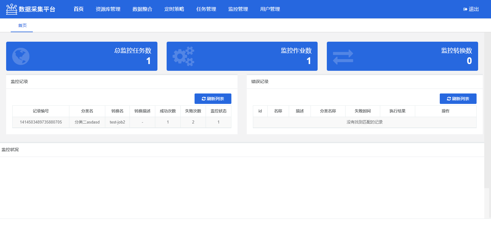
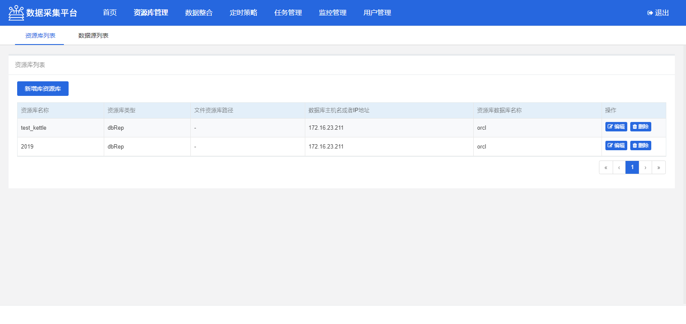
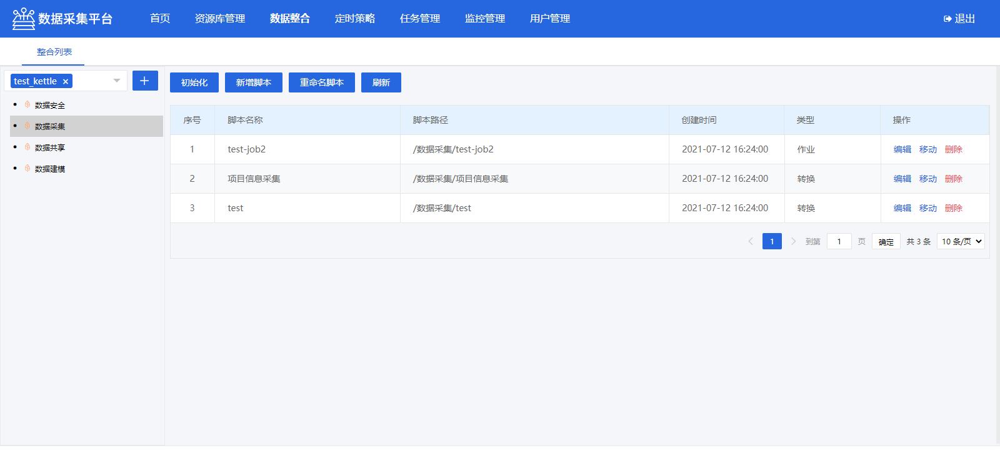
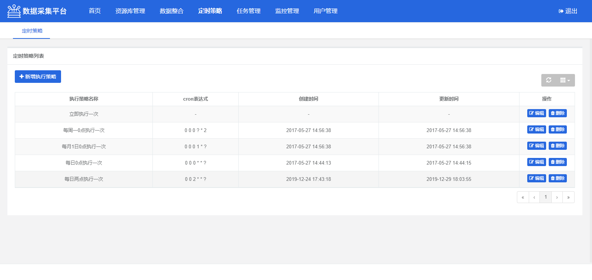
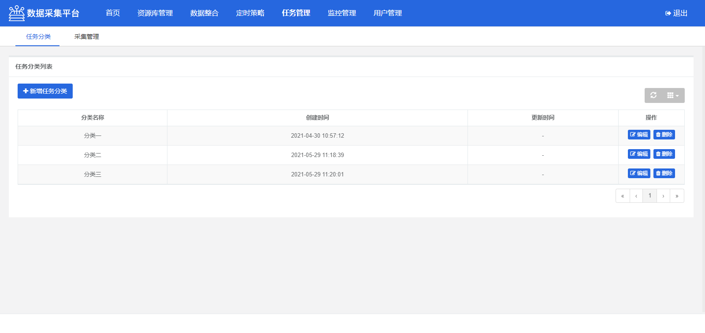
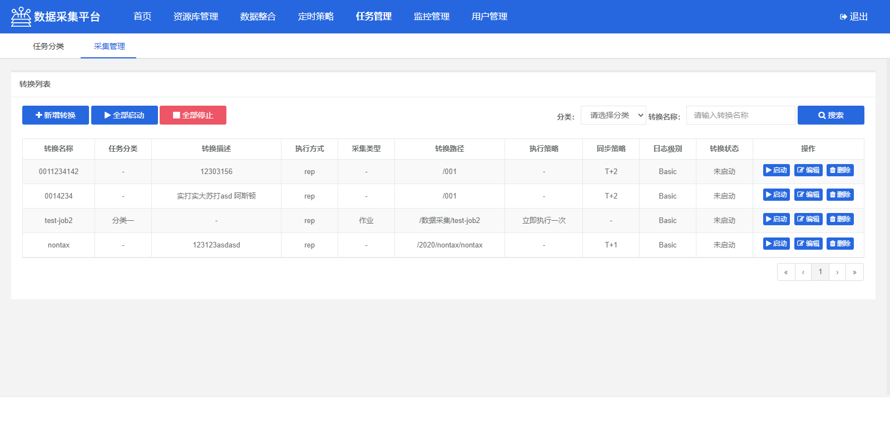
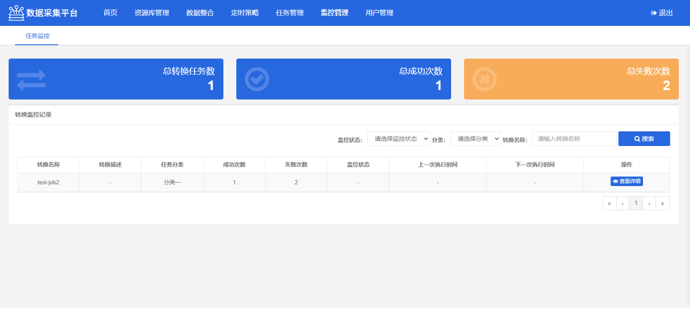
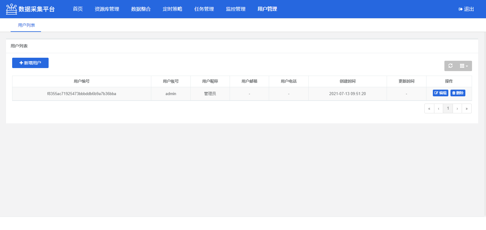

## 项目介绍

&emsp;dataCollection项目在kettle基础开发的可视化任务调度系统，提供简单易用的操作界面，降低用户使用crontab调度的学习成本，缩短任务配置时间，避免配置过程中出错。系统对接webSpoon，支持在线编辑kettle脚本，通过数据整合功能，可同步资源库中已有的脚本，用户在创建完脚本之后，可通过系统任务管理，创建数据同步任务。

## 特性

1、在线编辑kettle脚本，[webSpoon download](https://pan.baidu.com/s/1GLEhWI-YBge3k6_F-dvTGw)  提取码:
cffa [webSpoon配置说明](#webspoon配置说明)；   
2、资源库管理，避免脚本本地存储，版本错乱、丢失等问题；   
3、通过Web构建kettle采集任务；   
4、在线查看kettle执行结果及日志，便于排查采集问题；   
5、任务告警，系统支持邮件告警，所有异常信息即使掌握；

## [点击查看操作手册](./doc/OperationManual.md)
**感谢我的城市没有海提供的操作手册**   
## [dataCollection与spoon详细docker部署流程](https://docs.qq.com/doc/DR21VY09NbnFvWG9Q)   
**感谢summer23提供的文档**   
 
## [点击查看QA文档](./doc/QA.md)   

## [V0.0.7 版本包下载](./doc/version.md#V0.0.7)

## 编译安装
1、访问 [dataCollection](https://gitee.com/uxue/dataCollection) 的码云主页,拉取最新完整代码(建议使用master分支)   
2、导入doc文件夹中对应数据库脚本   
3、进入代码根目录执行 mvn clean package命令。注：pom中引入了oracle依赖，需将oracle驱动包打到本地的maven仓库中，[配置参照QA文档](./doc/QA.md#oracle)   
4、分别进入target\classes复制所有application开头的配置文件和target目录中的dataCollection-0.0.1-SNAPSHOT.jar文件至同一文件夹   
5、application.yml可配置应用端口，数据库使用Oracle还是MySQL，以及最末尾的webSpoon地址，无需带上http:// 6、application-kettle.yml文件配置kettle日志，插件等目录   
7、application-dbType.yml文件根据各自使用的数据库，选择数据库进行配置   
8、当前目录运行 java -jar dataCollection-0.0.7-SNAPSHOT.jar  
**注：   
1、整合列表中编辑，需在webSpoon配置好之后，两边需要有同名的资源库连接方可使用   
2、系统默认需要登录，可通过application.yml文件中，shouldLogin 属性控制是否需要登录**

### kettle资源库配置说明   
1、导入[kettle-rep-mysql.sql](./doc/sql/kettle-rep-mysql.sql)   
2、系统中配置导入上面脚本的资源库连接信息。   
默认资源库账号密码均为admin

## webSpoon配置说明

1、下载webSpoon安装包。   
2、下载tomcat8。   
3、将webSpoon安装包解压到tomcat的webapps目录。   
4、将kettle客户端的plugins，system两个目录复制到bin目录。   
5、启动tomcat即可。   
免配置webSpoon下载：[download](https://pan.baidu.com/s/1z76Zj7a__2b8_DEzA3_deQ) 提取码: fs3s   
webSpoon问题解决方案： [webSpoon QA](./doc/QA.md#webSpoon)    
**重要说明：   
spoon.war 下载:[download](https://www.aliyundrive.com/s/iEgVceFfMTv)   
数据整合跳转到webSpoon时URL已从原有明文调整为加密传输，需下载免配置包后，替换spoon.war或自行调整webSpoon的代码，详细路径如下：**
~~~shell
org.pentaho.di.ui.spoon.WebSpoonEntryPoint   
原URL http://10.11:8082/spoon/spoon?rep=10.110.6_MYSQL&user=admin&pass=admin&trans=124
这样直接暴露 用户名密码，安全扫描直接无法通过，所以要讲请求信息加密传输。
下面是加密后的请求路径
新URL http://10.11:8082/spoon/spoon?respoon=4f34e1b0ae89b47eac282682dcbde5bc2e0f7253322c100d992ec6b858bbb5270510d6618424ad75761196a73aef1197eaae2b12e67c3aa2d014822478f3667e
~~~

webSpoon    

## 系统截图   

登录页

系统首页

资源库管理

数据整合

定时策略

任务分类

采集管理

任务监控

用户管理

## 引用说明

**注:项目部分代码参照或直接从其他项目中copy**    
项目列表：
|  项目名称   | 项目主页  |
|  ----  | ----  |
| kettle-scheduler  | [https://github.com/zhaxiaodong9860](https://github.com/zhaxiaodong9860) |
| kettleweb  | [https://gitee.com/wind137/kettleweb](https://gitee.com/wind137/kettleweb) |
| kettle-scheduler-boot  | [https://gitee.com/uxue/kettle-scheduler-boot](https://gitee.com/uxue/kettle-scheduler-boot) |

## 参与贡献

1. Fork 本仓库
2. 新建 Feat_xxx 分支
3. 提交代码
4. 新建 Pull Request

## 感谢

项目开源至今，感谢一下朋友的各种帮助。（排名按时间先后顺序）

| 序号  |     名称     |            个人主页               |    捐赠方式    | 金额 |          备注                |  时间 |
| ---- | ----------- | -------------------------------- | ------------ | ---- | --------------------------- | ----- |
|  1   | 啦啦啦啦啦啦  | https://www.cnblogs.com/wlh1995/ | 维护Mysql分支  | XX   | kettle作者热心，一起加油。   | 2020-12-11 |
|  2   | 华子哥 | XXX | 微信  | 50 |  | 2021-01-20 |
|  3   | minxiangang | XXX | 微信  | 50 |  | 2021-07-16 |

## 关于我

1. 半码农
   

