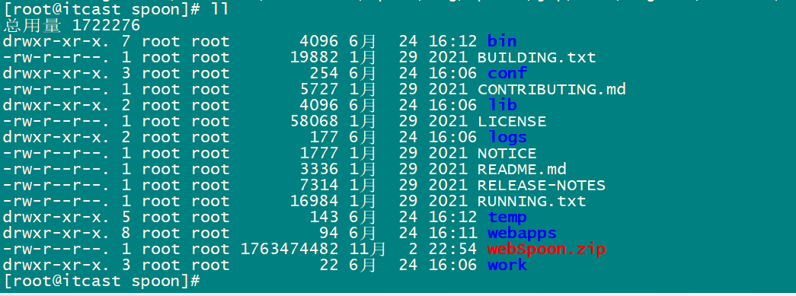
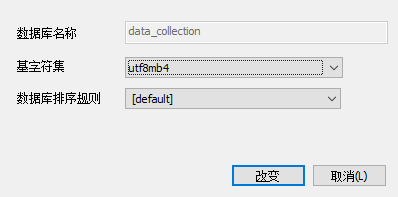
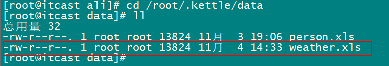
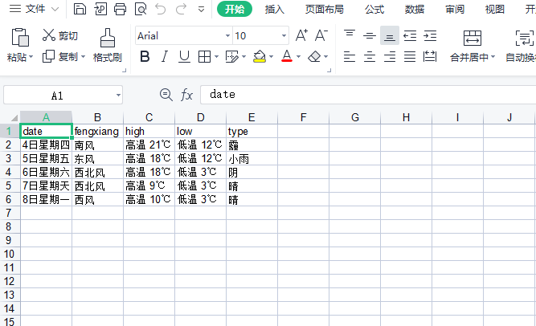

# 数据采集器部署和使用说明

## 1、部署WEB端kettle

### 1.1 将webSpoon.zip压缩包上传到linux根目录


### 1.2 创建spoon文件夹

```shell
mkdir spoon
```


### 1.3 将webSpoon.zip解压到spoon文件夹下

```shell
mv webSpoon.zip spoon

cd spoon

unzip webSpoon.zip
```

解压完成后查看目录



### 1.4 启动kettle web端

```shell
cd bin/

./startup.sh
```

**注意**:

​	./startup.sh后如果提示权限不够, 需要修改权限:
     启动路径要和 system、plugin、在同一个目录 ，
        例：若 system、plugin文件夹在bin目录下，启动直接使用上面方式。
            若system、plugin文件夹和bin同一级别，启动命令：bin/startup.sh

```shell
chmod -R 777 /spoon
```

```shell
./startup.sh
```


出现这个界面则启动成功


### 1.5 在windows上访问kettle

在浏览器上输入: http://ip:8080/spoon/spoon  (ip为linux的ip地址)


## 2、部署数据采集平台

### 2.1 在linux中安装jdk1.8并配置环境变量

#### 2.1.1 切换root用户

由于创建目录的位置，当前用户权限可能不够，需要添加当前登录用户的权限或者切换到root用户操作

切换用户命令：**su root**  然后输入密码即可


#### 2.1.2 创建安装jdk的文件目录

命令：

```shell
mkdir -p java/jdk
```


#### 2.1.3 下载jdk压缩包

注意：要先切换目录到jdk文件夹下，然后再运行下载命令

下载命令：

```shell
wget --no-check-certificate --no-cookies --header "Cookie: oraclelicense=accept-securebackup-cookie"  http://download.oracle.com/otn-pub/java/jdk/8u131-b11/d54c1d3a095b4ff2b6607d096fa80163/jdk-8u131-linux-x64.tar.gz
```

**注意**：如果wget命令不能用,报错：-bash: wget: command not found。执行一下该命令(安装依赖包)

```shell
yum -y install wget
```

下载命令运行后，等待下载完成


#### 2.1.4 解压

解压命令：

```shell
tar -zxvf jdk-8u131-linux-x64.tar.gz
```


解压完成后，会生成jdk1.8.0.131文件夹，输入命令：mv jdk1.8.0.131 jdk1.8 重命名一下


#### 2.1.5 配置环境变量

输入命令：vi /etc/profile

打开文件后，拉到最下面添加以下内容

```
export JAVA_HOME=/java/jdk/jdk1.8

export PATH=$PATH:$JAVA_HOME/bin
```


修改文件步骤：

(1) 按键盘 i 键 即变成可编辑状态

(2) 修改文件内容后退出：按ESC键

(3) 保存修改：冒号+x，如（：x）

(4) 不保存修改的内容：冒号+q!,如（:q!）


#### 2.1.6 查看环境配置是否成功

命令：java -version


### 2.2 docker中部署mysql


#### 2.2.1 拉取mysql镜像

```shell
docker pull mysql:5.7.23
```


#### 2.2.2 运行镜像文件

```shell
sudo docker run --name mysql -v /mysql/mysql-data/data:/var/lib/mysql -v  /mysql/conf:/etc/mysql -e MYSQL_ROOT_PASSWORD=root  -p 3306:3306 -d  mysql:5.7.23 
```


#### 2.2.3 创建数据库data_collection




#### 2.2.4 执行sql文件


#### 2.2.4 解决Linux中MySQL表名区别大小写的问题

(1) 切到MySQL配置文件**挂载**的目录

```shell
cd /mysql/conf/
```

(2) 编辑 my.cnf 配置文件

```shell
vim my.cnf
```

在 [mysqld] 下面添加: lower_case_table_names=1

即可忽略表名大小写


### 2.3 修改源码配置

#### 2.3.1 修改kettle配置文件

编辑 application-kettle.yml

```yml
kettle:
  log-file-path: /apps/logs/${spring.application.name}/run-logs
  encoding: utf-8
  upload-path: /apps/var/kettle-script-file
  kettle-home: /apps/var/file-rep
  kettlePluginPackages: /home/ali/data/plugins  
```


#### 2.3.2 上传kettle插件

将kettle插件包plugins上传到 **/home/ali/data/**  下


#### 2.3.3 配置webSpoon

在 application.yml配置文件中配置 kettle的url:

```yml
spoon:
  url: 192.168.200.129:8080/spoon/spoon
```


#### 2.3.4 配置数据源

application-mysql.yml

```yml
spring:
  datasource: # 数据库链接
    url: jdbc:mysql://192.168.200.129:3306/data_collection?useUnicode=true&characterEncoding=utf8&useSSL=false&allowPublicKeyRetrieval=true&serverTimezone=GMT%2B8
    username: root
    password: root  #数据库名、用户名和密码改为自己的
    driver-class-name: org.gjt.mm.mysql.Driver
```


#### 2.3.5 将源码打jar包


#### 2.3.6 部署linux运行

将dataCollection-0.0.6-SNAPSHOT.jar 包上传到 /java文件夹下,运行

```shell
cd /java

java -jar dataCollection-0.0.6-SNAPSHOT.jar
```


访问:  http://ip:7080/   出现以下界面 , 启动成功


## 3、数据采集平台使用说明

### 3.1 启动和登录

#### 3.1.1 启动

根据以上步骤进行启动 **kettle** 和 **数据采集平台**

#### 3.1.2 登录

默认账号密码都为 **admin**


### 3.2 首页

首页为任务的监控界面


### 3.3 资源管理库

#### 3.3.1 资源库列表

可以查看已经连接过的资源库列表


#### 3.3.2 新增资源库

点击新增库资源库


点击保存, 新建完成, 即可在列表中查看到刚才新建的数据库资源库


### 3.4 数据整合

#### 3.4.1 初始化资源库


#### 3.4.2 新增脚本

可以在四个目录任意一个下新增脚本


点击 **保存**, 会跳转到**kettle web端界面**

**如果是新建的数据库资源库**, 第一次新增脚本时需要在kettle界面**连接该数据库资源库**, 后续添加脚本则不需要

**步骤:**

(1) 点击右上角的 **Connect** 选择 **Repository Manager**


(2) 点击 **Add** 即: 新增资源库


(3) 点击 **Other Repositories**


(4) 选择 **Database Repository**, 然后点击 **Get Started**


(5) 设置**资源库名称** (**资源库名称**需要和**新增资源库时设置的名称保持一致**)


(6) 设置 **资源库连接**, 点击**New**


(7)  连接名称(自定义); 连接类型, 连接方式 , ip, 数据库名  端口号 用户名  密码 需要和新增资源库时保持一致, 然后点击测试


(8) 点击back返回后, 点击 **Finish**完成


(9) 返回数据采集平台, 选择脚本,点击**编辑**, 即可编写脚本


### 3.5 编写脚本

#### 3.5.1 读取数据库表数据存到Excel

(1) 选择**表输入**和**Excel输出**, 并使用  **shift + 鼠标左键** 建立连接


(2) 编辑**表输入**, 新建数据库连接, 选择要操作的数据库和表


点击**预览**, 显示如下, 表输入设置成功,点击确定


(3) 设置Excel输出


设置生成文件的路径: **/root/.kettle/data**


获取字段


**ctrl + s** 进行保存


#### 3.5.2  从http接口中获取数据保存到excel/txt

(1) 采用中华万年历天气API

url= http://wthrcdn.etouch.cn/weather_mini?city=郑州

返回数据:

```json
{
    "data": {
        "yesterday": {
            "date": "3日星期三",
            "high": "高温 21℃",
            "fx": "西南风",
            "low": "低温 9℃",
            "fl": "<![CDATA[1级]]>",
            "type": "霾"
        },
        "city": "郑州",
        "forecast": [
            {
                "date": "4日星期四",
                "high": "高温 22℃",
                "fengli": "<![CDATA[2级]]>",
                "low": "低温 13℃",
                "fengxiang": "南风",
                "type": "阴"
            },
            {
                "date": "5日星期五",
                "high": "高温 19℃",
                "fengli": "<![CDATA[2级]]>",
                "low": "低温 12℃",
                "fengxiang": "东风",
                "type": "小雨"
            },
            {
                "date": "6日星期六",
                "high": "高温 18℃",
                "fengli": "<![CDATA[3级]]>",
                "low": "低温 6℃",
                "fengxiang": "北风",
                "type": "阴"
            },
            {
                "date": "7日星期天",
                "high": "高温 10℃",
                "fengli": "<![CDATA[5级]]>",
                "low": "低温 5℃",
                "fengxiang": "西北风",
                "type": "晴"
            },
            {
                "date": "8日星期一",
                "high": "高温 11℃",
                "fengli": "<![CDATA[4级]]>",
                "low": "低温 5℃",
                "fengxiang": "西风",
                "type": "晴"
            }
        ],
        "ganmao": "感冒低发期，天气舒适，请注意多吃蔬菜水果，多喝水哦。",
        "wendu": "13"
    },
    "status": 1000,
    "desc": "OK"
}
```


(2) 定义url和参数


(3) 发请求


(3) 接收请求后的结果


(4) 字段选择


(5) 输出excel


ctrl + s 保存


### 3.6 定时策略

可以设置任务定时执行的策略, 即: 多长时间执行一次


### 3.7 任务管理

#### 3.7.1 任务分类

可以自定义任务分类


#### 3.7.2 采集管理

(1) 新增转换


(2) 启动转换


(3) 生成文件







### 3.8 监控管理

可以查看任务的执行记录和执行状态


### 3.9 用户管理

可以新增和删除用户

